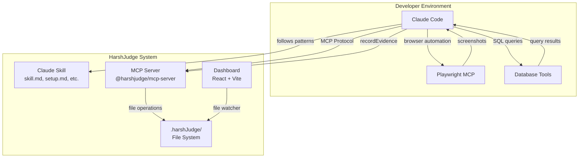
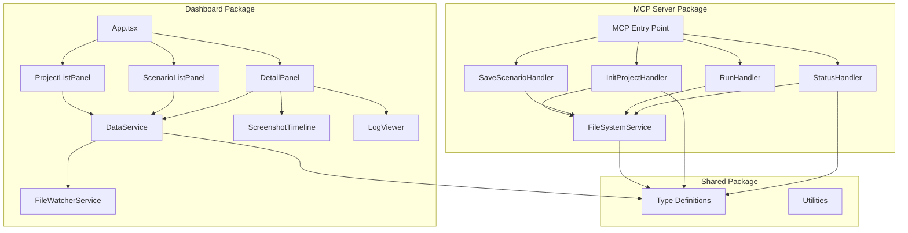
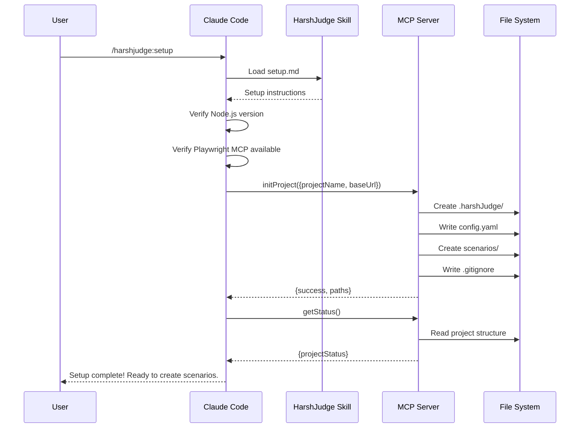
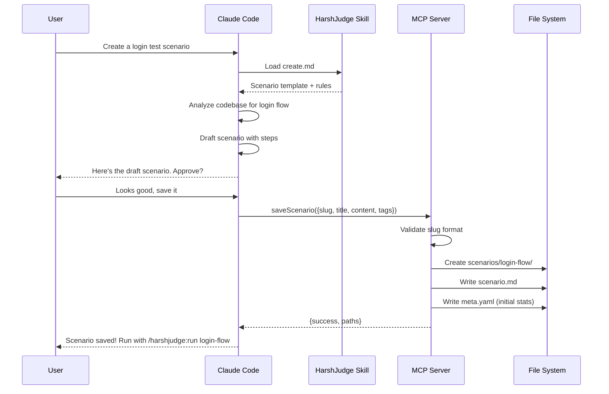
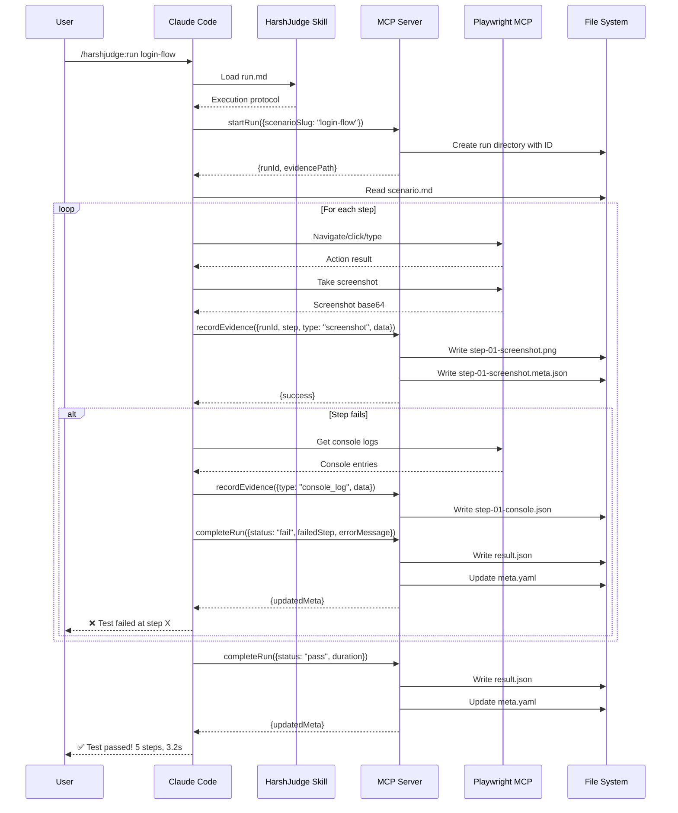
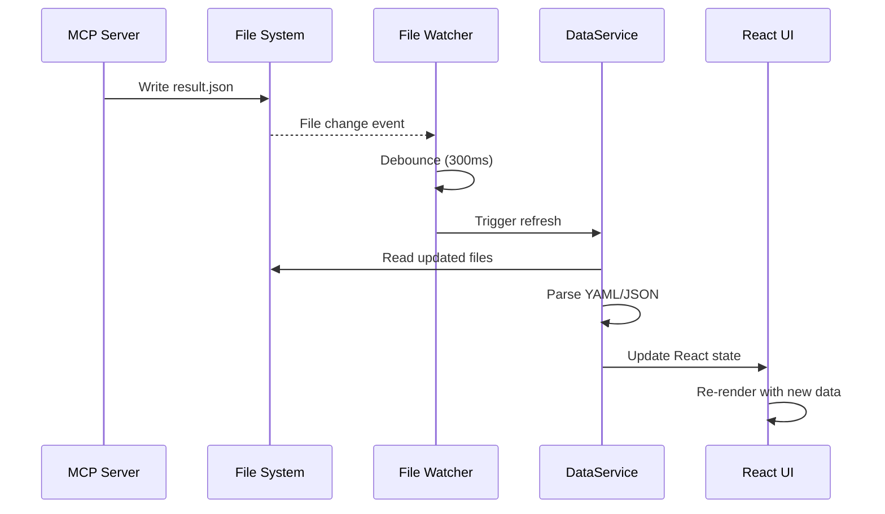
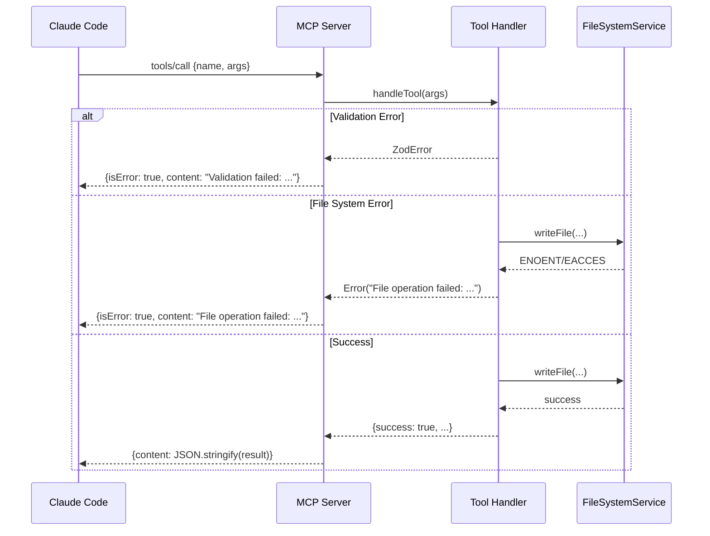

# HarshJudge Fullstack Architecture Document

## Change Log

| Date | Version | Description | Author |
|------|---------|-------------|--------|
| 2025-12-04 | 1.0 | Initial architecture document for Skill + MCP + Dashboard model | Winston (Architect) |

---

## 1. Introduction

This document outlines the complete fullstack architecture for **HarshJudge**, an AI-native end-to-end testing orchestration platform. It serves as the single source of truth for development, ensuring consistency across all components.

HarshJudge embraces a three-component architecture where Claude Code performs the heavy lifting (code analysis, test execution via Playwright MCP, database verification), while HarshJudge provides:
1. **Claude Skill** - Structured workflow patterns
2. **MCP Server** - Deterministic file storage
3. **Dashboard** - Read-only visibility

### 1.1 Starter Template Evaluation

**Decision: Greenfield with Turborepo**

After evaluating the requirements, a greenfield approach with Turborepo is selected over existing starter templates because:

1. **Unique Architecture:** The Skill + MCP + Dashboard model doesn't match any standard fullstack starter
2. **Minimal Dependencies:** We need very few libraries - no database ORM, no auth library, no Playwright integration
3. **MCP Protocol Specifics:** MCP server requires specific patterns not found in web app starters
4. **Simplicity:** Starting fresh avoids removing unused features from complex starters

**Turborepo Selected Over:**
- **Nx:** More enterprise-focused, heavier configuration
- **Lerna:** Less active development, Turborepo has better caching
- **npm Workspaces alone:** Lacks build orchestration

---

## 2. High Level Architecture

### 2.1 Technical Summary

HarshJudge implements a **local-first, file-system-as-database** architecture with three distinct components communicating through filesystem operations. The MCP server uses the Model Context Protocol (stdio) to receive commands from Claude Code, persisting all data in a `.harshJudge/` directory structure. The React dashboard watches this filesystem for real-time updates. This architecture achieves PRD goals by leveraging Claude's native capabilities for code analysis and test execution while providing organized, reviewable results through deterministic file storage.

### 2.2 Platform and Infrastructure Choice

**Platform:** Local-only (no cloud infrastructure)

**Key Services:**
- Node.js runtime for MCP server
- Vite dev server / static hosting for dashboard
- Filesystem for data storage

**Deployment:** Local installation via npm, no cloud regions required

**Rationale:** HarshJudge is privacy-first and runs entirely on the developer's machine. No external services, no data transmission, no infrastructure costs.

### 2.3 Repository Structure

**Structure:** Monorepo
**Monorepo Tool:** Turborepo
**Package Manager:** pnpm

**Package Organization:**
```
HarshJudge/
├── packages/
│   ├── mcp-server/     # @harshjudge/mcp-server
│   ├── ux/             # @harshjudge/ux (dashboard)
│   └── shared/         # @harshjudge/shared (types)
├── skills/
│   └── harshjudge/     # Claude skill files
└── turbo.json
```

### 2.4 High Level Architecture Diagram



### 2.5 Architectural Patterns

- **File-System-as-Database:** All data persisted as YAML/JSON/Markdown files in `.harshJudge/` - _Rationale:_ Git-friendly, portable, human-readable, no database setup required
- **Skill-Driven Workflow:** Claude Skill provides structured prompts for consistent behavior - _Rationale:_ Ensures deterministic patterns while allowing AI flexibility in execution
- **MCP Data Tunnel:** Lightweight MCP provides only file operations, no business logic - _Rationale:_ Single responsibility, minimal codebase, leverages existing Claude capabilities
- **Read-Only Dashboard:** Dashboard has no write capabilities, purely for visibility - _Rationale:_ All actions via Claude Code reinforces AI-native paradigm
- **Event-Driven Updates:** Dashboard uses file watchers (chokidar) for live updates - _Rationale:_ No polling, immediate feedback, simple implementation

---

## 3. Tech Stack

### 3.1 Technology Stack Table

| Category | Technology | Version | Purpose | Rationale |
|----------|------------|---------|---------|-----------|
| **Shared Language** | TypeScript | 5.3+ | Type safety across all packages | Strong typing, better DX, catch errors at compile time |
| **Runtime** | Node.js | 18+ LTS | MCP server and build tools | Native fetch, stable ESM, long-term support |
| **Package Manager** | pnpm | 8+ | Dependency management | Fast, disk-efficient, excellent monorepo support |
| **Monorepo** | Turborepo | 2.0+ | Build orchestration | Fast caching, parallel execution, simple config |
| **MCP SDK** | @modelcontextprotocol/sdk | latest | MCP protocol implementation | Official Anthropic SDK for tool registration |
| **Frontend Framework** | React | 18+ | Dashboard UI | Component model, hooks, mature ecosystem |
| **Build Tool** | Vite | 5+ | Frontend bundling and dev server | Fast HMR, modern defaults, excellent DX |
| **Styling** | TailwindCSS | 3.4+ | Utility-first CSS | Rapid development, dark mode support, small bundle |
| **YAML Parsing** | js-yaml | 4+ | Config and meta file handling | Standard, well-maintained, TypeScript support |
| **Markdown Parsing** | marked | 11+ | Scenario file rendering | Fast, extensible, GFM support |
| **File Watching** | chokidar | 3+ | Dashboard live updates | Cross-platform, reliable, efficient |
| **ID Generation** | nanoid | 5+ | Run IDs | Fast, URL-safe, no dependencies |
| **Schema Validation** | zod | 3+ | Input validation | Runtime validation, TypeScript inference |
| **Unit Testing** | Vitest | 1+ | Unit and integration tests | Fast, TypeScript-native, Vite-compatible |
| **Linting** | ESLint | 8+ | Code quality | Industry standard, extensive plugin ecosystem |
| **Formatting** | Prettier | 3+ | Code formatting | Consistent style, integrates with ESLint |

### 3.2 Notable Exclusions

| Not Included | Reason |
|--------------|--------|
| Playwright | Handled by external Playwright MCP |
| Database ORM | No database - file-system storage |
| Auth Library | No authentication required - local only |
| State Management (Redux, etc.) | React hooks sufficient for dashboard |
| CSS-in-JS | TailwindCSS covers all styling needs |
| Backend Framework (Express, etc.) | MCP SDK handles all server needs |

---

## 4. Data Models

### 4.1 HarshJudgeConfig

**Purpose:** Project-level configuration stored in `.harshJudge/config.yaml`

**Key Attributes:**
- `projectName`: string - Human-readable project name
- `baseUrl`: string - Base URL for the target application
- `version`: string - Config schema version
- `createdAt`: string - ISO timestamp of initialization

```typescript
// packages/shared/src/types/config.ts
export interface HarshJudgeConfig {
  projectName: string;
  baseUrl: string;
  version: string;
  createdAt: string;
}
```

**Relationships:**
- Parent of all Scenarios
- One per project

---

### 4.2 Scenario

**Purpose:** Test scenario definition stored as `scenario.md` with YAML frontmatter

**Key Attributes:**
- `id`: string - Unique identifier (same as slug)
- `title`: string - Human-readable title
- `tags`: string[] - Categorization tags
- `estimatedDuration`: number - Expected duration in seconds
- `content`: string - Markdown content with test steps

```typescript
// packages/shared/src/types/scenario.ts
export interface Scenario {
  id: string;
  title: string;
  tags: string[];
  estimatedDuration: number;
  content: string;
}

export interface ScenarioFrontmatter {
  id: string;
  title: string;
  tags: string[];
  estimatedDuration: number;
}
```

**Relationships:**
- Belongs to one Project (via directory structure)
- Has many Runs
- Has one ScenarioMeta

---

### 4.3 ScenarioMeta

**Purpose:** Machine-updated statistics stored in `meta.yaml`

**Key Attributes:**
- `totalRuns`: number - Count of all runs
- `passCount`: number - Count of passed runs
- `failCount`: number - Count of failed runs
- `lastRun`: string | null - ISO timestamp of last run
- `lastResult`: 'pass' | 'fail' | null - Result of last run
- `avgDuration`: number - Average run duration in ms

```typescript
// packages/shared/src/types/scenario.ts
export interface ScenarioMeta {
  totalRuns: number;
  passCount: number;
  failCount: number;
  lastRun: string | null;
  lastResult: 'pass' | 'fail' | null;
  avgDuration: number;
}
```

**Relationships:**
- One-to-one with Scenario

---

### 4.4 Run

**Purpose:** Single execution of a scenario

**Key Attributes:**
- `id`: string - Unique run ID (nanoid)
- `scenarioSlug`: string - Parent scenario identifier
- `runNumber`: number - Sequential run number for this scenario
- `startedAt`: string - ISO timestamp
- `status`: 'running' | 'completed' - Current status

```typescript
// packages/shared/src/types/run.ts
export interface Run {
  id: string;
  scenarioSlug: string;
  runNumber: number;
  startedAt: string;
  status: 'running' | 'completed';
}
```

**Relationships:**
- Belongs to one Scenario
- Has many Evidence artifacts
- Has one RunResult (when completed)

---

### 4.5 RunResult

**Purpose:** Final outcome of a run stored in `result.json`

**Key Attributes:**
- `runId`: string - Reference to parent run
- `status`: 'pass' | 'fail' - Final status
- `duration`: number - Total duration in ms
- `completedAt`: string - ISO timestamp
- `failedStep`: number | null - Step number that failed
- `errorMessage`: string | null - Error description

```typescript
// packages/shared/src/types/run.ts
export interface RunResult {
  runId: string;
  status: 'pass' | 'fail';
  duration: number;
  completedAt: string;
  failedStep: number | null;
  errorMessage: string | null;
  stepCount: number;
  evidenceCount: number;
}
```

**Relationships:**
- One-to-one with Run

---

### 4.6 Evidence

**Purpose:** Artifacts captured during test execution

**Key Attributes:**
- `runId`: string - Parent run ID
- `step`: number - Step number (1-based)
- `type`: EvidenceType - Type of evidence
- `name`: string - Descriptive name
- `filePath`: string - Relative path to file
- `capturedAt`: string - ISO timestamp

```typescript
// packages/shared/src/types/evidence.ts
export type EvidenceType =
  | 'screenshot'
  | 'db_snapshot'
  | 'console_log'
  | 'network_log'
  | 'html_snapshot'
  | 'custom';

export interface Evidence {
  runId: string;
  step: number;
  type: EvidenceType;
  name: string;
  filePath: string;
  capturedAt: string;
  metadata?: Record<string, unknown>;
}

export interface EvidenceMeta {
  runId: string;
  step: number;
  type: EvidenceType;
  name: string;
  capturedAt: string;
  fileSize: number;
  metadata?: Record<string, unknown>;
}
```

**Relationships:**
- Belongs to one Run
- Stored as file with accompanying `.meta.json`

---

### 4.7 ProjectStatus

**Purpose:** Aggregated status for dashboard queries

```typescript
// packages/shared/src/types/status.ts
export interface ScenarioSummary {
  slug: string;
  title: string;
  tags: string[];
  lastResult: 'pass' | 'fail' | null;
  lastRun: string | null;
  totalRuns: number;
  passRate: number;
}

export interface ProjectStatus {
  projectName: string;
  scenarioCount: number;
  passing: number;
  failing: number;
  neverRun: number;
  scenarios: ScenarioSummary[];
}

export interface ScenarioDetail {
  slug: string;
  title: string;
  tags: string[];
  content: string;
  meta: ScenarioMeta;
  recentRuns: RunSummary[];
}

export interface RunSummary {
  id: string;
  runNumber: number;
  status: 'pass' | 'fail';
  duration: number;
  completedAt: string;
  errorMessage: string | null;
}
```

---

## 5. API Specification (MCP Tools)

HarshJudge uses MCP protocol instead of REST/GraphQL. The MCP server exposes 6 tools.

### 5.1 MCP Tool Schemas

```typescript
// packages/shared/src/types/mcp-tools.ts
import { z } from 'zod';

// ============================================================
// initProject
// ============================================================
export const InitProjectParams = z.object({
  projectName: z.string().min(1).max(100),
  baseUrl: z.string().url().optional(),
});
export type InitProjectParams = z.infer<typeof InitProjectParams>;

export interface InitProjectResult {
  success: boolean;
  projectPath: string;
  configPath: string;
  scenariosPath: string;
}

// ============================================================
// saveScenario
// ============================================================
export const SaveScenarioParams = z.object({
  slug: z.string().regex(/^[a-z0-9-]+$/, 'Slug must be lowercase alphanumeric with hyphens'),
  title: z.string().min(1).max(200),
  content: z.string().min(1),
  tags: z.array(z.string()).optional().default([]),
  estimatedDuration: z.number().positive().optional().default(60),
});
export type SaveScenarioParams = z.infer<typeof SaveScenarioParams>;

export interface SaveScenarioResult {
  success: boolean;
  slug: string;
  scenarioPath: string;
  metaPath: string;
  isNew: boolean;
}

// ============================================================
// startRun
// ============================================================
export const StartRunParams = z.object({
  scenarioSlug: z.string().regex(/^[a-z0-9-]+$/),
});
export type StartRunParams = z.infer<typeof StartRunParams>;

export interface StartRunResult {
  success: boolean;
  runId: string;
  runNumber: number;
  runPath: string;
  evidencePath: string;
  startedAt: string;
}

// ============================================================
// recordEvidence
// ============================================================
export const RecordEvidenceParams = z.object({
  runId: z.string().min(1),
  step: z.number().int().positive(),
  type: z.enum(['screenshot', 'db_snapshot', 'console_log', 'network_log', 'html_snapshot', 'custom']),
  name: z.string().min(1).max(100),
  data: z.string(), // base64 for binary, JSON string for objects, plain text for logs
  metadata: z.record(z.unknown()).optional(),
});
export type RecordEvidenceParams = z.infer<typeof RecordEvidenceParams>;

export interface RecordEvidenceResult {
  success: boolean;
  filePath: string;
  metaPath: string;
  fileSize: number;
}

// ============================================================
// completeRun
// ============================================================
export const CompleteRunParams = z.object({
  runId: z.string().min(1),
  status: z.enum(['pass', 'fail']),
  duration: z.number().nonnegative(),
  failedStep: z.number().int().positive().optional(),
  errorMessage: z.string().optional(),
});
export type CompleteRunParams = z.infer<typeof CompleteRunParams>;

export interface CompleteRunResult {
  success: boolean;
  resultPath: string;
  updatedMeta: {
    totalRuns: number;
    passCount: number;
    failCount: number;
    avgDuration: number;
  };
}

// ============================================================
// getStatus
// ============================================================
export const GetStatusParams = z.object({
  scenarioSlug: z.string().regex(/^[a-z0-9-]+$/).optional(),
});
export type GetStatusParams = z.infer<typeof GetStatusParams>;

export type GetStatusResult = ProjectStatus | ScenarioDetail;
```

### 5.2 MCP Tool Registration

```typescript
// packages/mcp-server/src/tools/index.ts
import { Server } from '@modelcontextprotocol/sdk/server/index.js';

export function registerTools(server: Server) {
  server.setRequestHandler('tools/list', async () => ({
    tools: [
      {
        name: 'initProject',
        description: 'Initialize a HarshJudge project in the current directory',
        inputSchema: {
          type: 'object',
          properties: {
            projectName: { type: 'string', description: 'Project name' },
            baseUrl: { type: 'string', description: 'Base URL of target application' },
          },
          required: ['projectName'],
        },
      },
      {
        name: 'saveScenario',
        description: 'Save a test scenario to the filesystem',
        inputSchema: {
          type: 'object',
          properties: {
            slug: { type: 'string', description: 'URL-safe identifier' },
            title: { type: 'string', description: 'Human-readable title' },
            content: { type: 'string', description: 'Markdown content with test steps' },
            tags: { type: 'array', items: { type: 'string' }, description: 'Tags for categorization' },
            estimatedDuration: { type: 'number', description: 'Expected duration in seconds' },
          },
          required: ['slug', 'title', 'content'],
        },
      },
      {
        name: 'startRun',
        description: 'Start a new test run for a scenario',
        inputSchema: {
          type: 'object',
          properties: {
            scenarioSlug: { type: 'string', description: 'Scenario identifier' },
          },
          required: ['scenarioSlug'],
        },
      },
      {
        name: 'recordEvidence',
        description: 'Record test evidence (screenshot, log, db snapshot)',
        inputSchema: {
          type: 'object',
          properties: {
            runId: { type: 'string', description: 'Run identifier' },
            step: { type: 'number', description: 'Step number (1-based)' },
            type: {
              type: 'string',
              enum: ['screenshot', 'db_snapshot', 'console_log', 'network_log', 'html_snapshot', 'custom'],
              description: 'Type of evidence',
            },
            name: { type: 'string', description: 'Descriptive name for the evidence' },
            data: { type: 'string', description: 'Evidence data (base64 for binary, JSON/text otherwise)' },
            metadata: { type: 'object', description: 'Optional additional metadata' },
          },
          required: ['runId', 'step', 'type', 'name', 'data'],
        },
      },
      {
        name: 'completeRun',
        description: 'Complete a test run with final results',
        inputSchema: {
          type: 'object',
          properties: {
            runId: { type: 'string', description: 'Run identifier' },
            status: { type: 'string', enum: ['pass', 'fail'], description: 'Final status' },
            duration: { type: 'number', description: 'Total duration in milliseconds' },
            failedStep: { type: 'number', description: 'Step number that failed (if failed)' },
            errorMessage: { type: 'string', description: 'Error description (if failed)' },
          },
          required: ['runId', 'status', 'duration'],
        },
      },
      {
        name: 'getStatus',
        description: 'Get status of all scenarios or a specific scenario',
        inputSchema: {
          type: 'object',
          properties: {
            scenarioSlug: { type: 'string', description: 'Optional scenario identifier for detailed status' },
          },
        },
      },
    ],
  }));
}
```

---

## 6. Components

### 6.1 MCP Server Components

#### FileSystemService

**Responsibility:** All file read/write operations for `.harshJudge/` directory

**Key Interfaces:**
- `ensureDir(path: string): Promise<void>`
- `writeYaml(path: string, data: object): Promise<void>`
- `readYaml<T>(path: string): Promise<T>`
- `writeJson(path: string, data: object): Promise<void>`
- `readJson<T>(path: string): Promise<T>`
- `writeFile(path: string, data: Buffer | string): Promise<void>`
- `exists(path: string): Promise<boolean>`
- `listDirs(path: string): Promise<string[]>`

**Dependencies:** Node.js fs/promises, js-yaml

**Technology Stack:** TypeScript, Node.js native fs

---

#### InitProjectHandler

**Responsibility:** Handle `initProject` MCP tool calls

**Key Interfaces:**
- `handle(params: InitProjectParams): Promise<InitProjectResult>`

**Dependencies:** FileSystemService

**Technology Stack:** TypeScript, zod validation

---

#### SaveScenarioHandler

**Responsibility:** Handle `saveScenario` MCP tool calls

**Key Interfaces:**
- `handle(params: SaveScenarioParams): Promise<SaveScenarioResult>`
- `generateSlug(title: string): string`
- `handleDuplicateSlug(slug: string): string`

**Dependencies:** FileSystemService

**Technology Stack:** TypeScript, zod validation

---

#### RunHandler

**Responsibility:** Handle `startRun`, `recordEvidence`, `completeRun` tool calls

**Key Interfaces:**
- `startRun(params: StartRunParams): Promise<StartRunResult>`
- `recordEvidence(params: RecordEvidenceParams): Promise<RecordEvidenceResult>`
- `completeRun(params: CompleteRunParams): Promise<CompleteRunResult>`

**Dependencies:** FileSystemService, nanoid

**Technology Stack:** TypeScript, zod validation, nanoid

---

#### StatusHandler

**Responsibility:** Handle `getStatus` MCP tool calls

**Key Interfaces:**
- `handle(params: GetStatusParams): Promise<GetStatusResult>`
- `getProjectStatus(): Promise<ProjectStatus>`
- `getScenarioDetail(slug: string): Promise<ScenarioDetail>`

**Dependencies:** FileSystemService

**Technology Stack:** TypeScript

---

### 6.2 Dashboard Components

#### FileWatcherService

**Responsibility:** Watch `.harshJudge/` for changes and emit events

**Key Interfaces:**
- `start(basePath: string): void`
- `stop(): void`
- `onUpdate(callback: () => void): void`

**Dependencies:** chokidar

**Technology Stack:** TypeScript, chokidar

---

#### DataService

**Responsibility:** Read and parse `.harshJudge/` data for dashboard

**Key Interfaces:**
- `getProjects(): Promise<ProjectSummary[]>`
- `getScenarios(projectPath: string): Promise<ScenarioSummary[]>`
- `getScenarioDetail(slug: string): Promise<ScenarioDetail>`
- `getRunDetail(runId: string): Promise<RunDetail>`

**Dependencies:** FileWatcherService, js-yaml, marked

**Technology Stack:** TypeScript, React hooks

---

#### ProjectListPanel

**Responsibility:** Display list of projects with status indicators

**Key Interfaces:**
- `onSelect(projectPath: string): void`
- Props: `projects: ProjectSummary[]`, `selected: string | null`

**Dependencies:** DataService

**Technology Stack:** React, TailwindCSS

---

#### ScenarioListPanel

**Responsibility:** Display scenarios for selected project

**Key Interfaces:**
- `onSelect(slug: string): void`
- Props: `scenarios: ScenarioSummary[]`, `selected: string | null`

**Dependencies:** DataService

**Technology Stack:** React, TailwindCSS

---

#### DetailPanel

**Responsibility:** Display scenario details, run history, and run viewer

**Key Interfaces:**
- Props: `scenario: ScenarioDetail | null`, `selectedRun: string | null`

**Dependencies:** DataService, ScreenshotTimeline, LogViewer

**Technology Stack:** React, TailwindCSS, marked

---

#### ScreenshotTimeline

**Responsibility:** Step-by-step timeline view of run screenshots

**Key Interfaces:**
- `onStepSelect(step: number): void`
- Props: `evidence: Evidence[]`, `currentStep: number`

**Dependencies:** None

**Technology Stack:** React, TailwindCSS

---

#### LogViewer

**Responsibility:** Display captured logs for failed runs

**Key Interfaces:**
- Props: `logs: Evidence[]`, `activeTab: string`

**Dependencies:** None

**Technology Stack:** React, TailwindCSS

---

### 6.3 Component Diagram



---

## 7. Core Workflows

### 7.1 Project Initialization Workflow



### 7.2 Scenario Creation Workflow



### 7.3 Test Execution Workflow



### 7.4 Dashboard Update Workflow



---

## 8. Database Schema

HarshJudge uses **file-system-as-database**. No traditional database is used.

### 8.1 Directory Structure Schema

```
.harshJudge/
├── config.yaml                           # Project configuration
├── .gitignore                            # Git ignore patterns
└── scenarios/
    └── {scenario-slug}/                  # One directory per scenario
        ├── scenario.md                   # Scenario definition
        ├── meta.yaml                     # Statistics (machine-updated)
        └── runs/
            └── {run-id}/                 # One directory per run
                ├── result.json           # Run outcome
                └── evidence/
                    ├── step-01-{name}.png
                    ├── step-01-{name}.meta.json
                    ├── step-02-{name}.json
                    └── step-02-{name}.meta.json
```

### 8.2 File Schemas

#### config.yaml
```yaml
projectName: "My App"
baseUrl: "http://localhost:3000"
version: "1.0"
createdAt: "2025-12-04T10:00:00Z"
```

#### scenario.md
```markdown
---
id: login-flow
title: User Login Flow
tags: [auth, critical]
estimatedDuration: 30
---

## Overview
Test the complete user login flow.

## Prerequisites
- Test user exists: test@example.com / password123
- Application running at http://localhost:3000

## Steps

### Step 1: Navigate to Login
**Action:** Go to the login page
**Playwright:**
```javascript
await page.goto('/login');
```
**Verify:** Login form is visible

### Step 2: Enter Credentials
**Action:** Fill in credentials
**Playwright:**
```javascript
await page.fill('[data-testid="email"]', 'test@example.com');
await page.fill('[data-testid="password"]', 'password123');
```
**Verify:** Fields are populated

### Step 3: Submit Form
**Action:** Click login button
**Playwright:**
```javascript
await page.click('[data-testid="login-button"]');
await page.waitForURL('/dashboard');
```
**Verify:** Redirected to dashboard
**DB Verification:**
```sql
SELECT last_login FROM users WHERE email = 'test@example.com';
-- Should be within last minute
```

## Expected Final State
- User is logged in
- Dashboard page is displayed
- Session cookie is set
```

#### meta.yaml
```yaml
totalRuns: 5
passCount: 4
failCount: 1
lastRun: "2025-12-04T15:30:00Z"
lastResult: pass
avgDuration: 3200
```

#### result.json
```json
{
  "runId": "abc123xyz",
  "status": "pass",
  "duration": 3150,
  "completedAt": "2025-12-04T15:30:00Z",
  "failedStep": null,
  "errorMessage": null,
  "stepCount": 3,
  "evidenceCount": 6
}
```

#### evidence/{step}-{name}.meta.json
```json
{
  "runId": "abc123xyz",
  "step": 1,
  "type": "screenshot",
  "name": "login-page",
  "capturedAt": "2025-12-04T15:29:58Z",
  "fileSize": 45678,
  "metadata": {
    "url": "http://localhost:3000/login",
    "viewport": { "width": 1280, "height": 720 }
  }
}
```

### 8.3 Indexing Strategy

Since file-system-as-database doesn't support queries, the dashboard uses in-memory indexing:

1. **On Load:** Read all `meta.yaml` files into memory
2. **On Change:** File watcher triggers selective re-read
3. **Caching:** Recent reads cached with TTL
4. **Performance:** For 100+ scenarios, < 1s load time (per NFR3)

---

## 9. Frontend Architecture

### 9.1 Component Architecture

#### Component Organization
```
packages/ux/src/
├── components/
│   ├── layout/
│   │   ├── Header.tsx
│   │   ├── ThreeColumnLayout.tsx
│   │   └── ResizablePanel.tsx
│   ├── panels/
│   │   ├── ProjectListPanel.tsx
│   │   ├── ScenarioListPanel.tsx
│   │   └── DetailPanel.tsx
│   ├── viewers/
│   │   ├── ScreenshotTimeline.tsx
│   │   ├── ScreenshotViewer.tsx
│   │   ├── LogViewer.tsx
│   │   └── MarkdownRenderer.tsx
│   ├── common/
│   │   ├── StatusBadge.tsx
│   │   ├── EmptyState.tsx
│   │   ├── LoadingSpinner.tsx
│   │   └── ErrorBoundary.tsx
│   └── index.ts
├── hooks/
│   ├── useProjects.ts
│   ├── useScenarios.ts
│   ├── useScenarioDetail.ts
│   ├── useRunDetail.ts
│   ├── useFileWatcher.ts
│   └── useTheme.ts
├── services/
│   ├── FileWatcherService.ts
│   └── DataService.ts
├── types/
│   └── index.ts                # Re-exports from @harshjudge/shared
├── lib/
│   ├── parsers.ts
│   └── formatters.ts
├── styles/
│   └── globals.css
├── App.tsx
└── main.tsx
```

#### Component Template
```typescript
// packages/ux/src/components/panels/ProjectListPanel.tsx
import { type FC } from 'react';
import { type ProjectSummary } from '@harshjudge/shared';
import { StatusBadge } from '../common/StatusBadge';
import { EmptyState } from '../common/EmptyState';

interface ProjectListPanelProps {
  projects: ProjectSummary[];
  selectedProject: string | null;
  onSelect: (projectPath: string) => void;
}

export const ProjectListPanel: FC<ProjectListPanelProps> = ({
  projects,
  selectedProject,
  onSelect,
}) => {
  if (projects.length === 0) {
    return (
      <EmptyState
        title="No projects found"
        description="Initialize a project with /harshjudge:setup"
      />
    );
  }

  return (
    <div className="flex flex-col h-full">
      <header className="p-3 border-b border-gray-700">
        <h2 className="text-sm font-medium text-gray-400">
          Projects ({projects.length})
        </h2>
      </header>
      <ul className="flex-1 overflow-y-auto">
        {projects.map((project) => (
          <li
            key={project.path}
            className={`
              p-3 cursor-pointer border-b border-gray-800
              hover:bg-gray-800
              ${selectedProject === project.path ? 'bg-gray-800' : ''}
            `}
            onClick={() => onSelect(project.path)}
          >
            <div className="flex items-center justify-between">
              <span className="text-sm font-medium">{project.name}</span>
              <StatusBadge status={project.overallStatus} />
            </div>
            <span className="text-xs text-gray-500">
              {project.scenarioCount} scenarios
            </span>
          </li>
        ))}
      </ul>
    </div>
  );
};
```

### 9.2 State Management Architecture

#### State Structure
```typescript
// packages/ux/src/hooks/useAppState.ts
import { useState, useCallback } from 'react';

interface AppState {
  projects: ProjectSummary[];
  selectedProject: string | null;
  scenarios: ScenarioSummary[];
  selectedScenario: string | null;
  scenarioDetail: ScenarioDetail | null;
  selectedRun: string | null;
  runDetail: RunDetail | null;
  isLoading: boolean;
  error: string | null;
}

const initialState: AppState = {
  projects: [],
  selectedProject: null,
  scenarios: [],
  selectedScenario: null,
  scenarioDetail: null,
  selectedRun: null,
  runDetail: null,
  isLoading: true,
  error: null,
};
```

#### State Management Patterns
- **React useState + useReducer:** Simple state, no external library needed
- **Derived State:** Computed from base state, not stored
- **Lift State Up:** App.tsx holds primary state, passes down via props
- **Custom Hooks:** Encapsulate data fetching and subscription logic
- **Optimistic Updates:** Not applicable (read-only dashboard)

### 9.3 Routing Architecture

#### Route Organization
```
/ (root)
└── Dashboard (single page app, no routing needed)
```

Since the dashboard is a single-page application with panel-based navigation, no router is required. Selection state is managed via React state.

#### URL State Sync (Future Enhancement)
```typescript
// Future: Sync selection to URL for deep linking
// packages/ux/src/hooks/useUrlState.ts
export function useUrlState() {
  // ?project=myapp&scenario=login&run=abc123
}
```

### 9.4 Frontend Services Layer

#### File Watcher Setup
```typescript
// packages/ux/src/services/FileWatcherService.ts
import chokidar from 'chokidar';

export class FileWatcherService {
  private watcher: chokidar.FSWatcher | null = null;
  private callbacks: Set<() => void> = new Set();
  private debounceTimer: NodeJS.Timeout | null = null;

  start(basePath: string): void {
    if (this.watcher) {
      this.stop();
    }

    this.watcher = chokidar.watch(basePath, {
      ignored: /(^|[\/\\])\../, // ignore dotfiles except .harshJudge
      persistent: true,
      ignoreInitial: true,
      depth: 5,
    });

    this.watcher.on('all', (event, path) => {
      this.debouncedNotify();
    });
  }

  private debouncedNotify(): void {
    if (this.debounceTimer) {
      clearTimeout(this.debounceTimer);
    }
    this.debounceTimer = setTimeout(() => {
      this.callbacks.forEach((cb) => cb());
    }, 300);
  }

  onUpdate(callback: () => void): () => void {
    this.callbacks.add(callback);
    return () => this.callbacks.delete(callback);
  }

  stop(): void {
    if (this.watcher) {
      this.watcher.close();
      this.watcher = null;
    }
  }
}

export const fileWatcher = new FileWatcherService();
```

#### Data Service
```typescript
// packages/ux/src/services/DataService.ts
import { readFile, readdir } from 'fs/promises';
import { join } from 'path';
import yaml from 'js-yaml';
import { marked } from 'marked';
import type { ProjectStatus, ScenarioDetail, RunDetail } from '@harshjudge/shared';

export class DataService {
  constructor(private basePath: string) {}

  async getProjects(): Promise<ProjectSummary[]> {
    // Find all .harshJudge directories
    // Parse config.yaml from each
    // Calculate aggregate status
  }

  async getScenarios(projectPath: string): Promise<ScenarioSummary[]> {
    const scenariosPath = join(projectPath, 'scenarios');
    const dirs = await readdir(scenariosPath, { withFileTypes: true });

    return Promise.all(
      dirs
        .filter((d) => d.isDirectory())
        .map(async (d) => {
          const metaPath = join(scenariosPath, d.name, 'meta.yaml');
          const meta = yaml.load(await readFile(metaPath, 'utf-8'));
          return {
            slug: d.name,
            ...meta,
          };
        })
    );
  }

  async getScenarioDetail(projectPath: string, slug: string): Promise<ScenarioDetail> {
    const scenarioPath = join(projectPath, 'scenarios', slug);
    const [scenarioMd, metaYaml] = await Promise.all([
      readFile(join(scenarioPath, 'scenario.md'), 'utf-8'),
      readFile(join(scenarioPath, 'meta.yaml'), 'utf-8'),
    ]);

    // Parse frontmatter + content
    // Get recent runs
    return { /* ... */ };
  }

  async getRunDetail(runPath: string): Promise<RunDetail> {
    const resultJson = await readFile(join(runPath, 'result.json'), 'utf-8');
    const evidence = await this.loadEvidence(join(runPath, 'evidence'));
    return { /* ... */ };
  }
}
```

---

## 10. Backend Architecture (MCP Server)

### 10.1 Service Architecture

Since HarshJudge MCP is a lightweight file-operations server, it uses a simple handler-based architecture rather than full serverless or traditional server patterns.

#### Handler Organization
```
packages/mcp-server/src/
├── handlers/
│   ├── initProject.ts
│   ├── saveScenario.ts
│   ├── startRun.ts
│   ├── recordEvidence.ts
│   ├── completeRun.ts
│   └── getStatus.ts
├── services/
│   └── FileSystemService.ts
├── utils/
│   ├── slugify.ts
│   ├── validation.ts
│   └── paths.ts
├── types/
│   └── index.ts              # Re-exports from @harshjudge/shared
├── server.ts                 # MCP server setup
└── index.ts                  # Entry point
```

#### Handler Template
```typescript
// packages/mcp-server/src/handlers/initProject.ts
import { z } from 'zod';
import { FileSystemService } from '../services/FileSystemService';
import { InitProjectParams, InitProjectResult } from '@harshjudge/shared';

const fs = new FileSystemService();

export async function handleInitProject(
  params: unknown
): Promise<InitProjectResult> {
  // 1. Validate input
  const validated = InitProjectParams.parse(params);

  // 2. Check if already initialized
  const harshJudgePath = '.harshJudge';
  if (await fs.exists(harshJudgePath)) {
    throw new Error('Project already initialized. Use a different directory or remove existing .harshJudge folder.');
  }

  // 3. Create directory structure
  await fs.ensureDir(harshJudgePath);
  await fs.ensureDir(`${harshJudgePath}/scenarios`);

  // 4. Write config
  const config = {
    projectName: validated.projectName,
    baseUrl: validated.baseUrl || '',
    version: '1.0',
    createdAt: new Date().toISOString(),
  };
  await fs.writeYaml(`${harshJudgePath}/config.yaml`, config);

  // 5. Write gitignore
  const gitignore = `# HarshJudge
# Ignore large evidence files in CI
scenarios/*/runs/*/evidence/*.png
scenarios/*/runs/*/evidence/*.html
`;
  await fs.writeFile(`${harshJudgePath}/.gitignore`, gitignore);

  // 6. Return result
  return {
    success: true,
    projectPath: harshJudgePath,
    configPath: `${harshJudgePath}/config.yaml`,
    scenariosPath: `${harshJudgePath}/scenarios`,
  };
}
```

### 10.2 File System Service

```typescript
// packages/mcp-server/src/services/FileSystemService.ts
import { mkdir, writeFile, readFile, access, readdir } from 'fs/promises';
import { dirname, join } from 'path';
import yaml from 'js-yaml';

export class FileSystemService {
  private basePath: string;

  constructor(basePath: string = process.cwd()) {
    this.basePath = basePath;
  }

  private resolve(path: string): string {
    return join(this.basePath, path);
  }

  async ensureDir(path: string): Promise<void> {
    await mkdir(this.resolve(path), { recursive: true });
  }

  async exists(path: string): Promise<boolean> {
    try {
      await access(this.resolve(path));
      return true;
    } catch {
      return false;
    }
  }

  async writeYaml(path: string, data: object): Promise<void> {
    const content = yaml.dump(data, { indent: 2 });
    await this.writeFile(path, content);
  }

  async readYaml<T>(path: string): Promise<T> {
    const content = await readFile(this.resolve(path), 'utf-8');
    return yaml.load(content) as T;
  }

  async writeJson(path: string, data: object): Promise<void> {
    const content = JSON.stringify(data, null, 2);
    await this.writeFile(path, content);
  }

  async readJson<T>(path: string): Promise<T> {
    const content = await readFile(this.resolve(path), 'utf-8');
    return JSON.parse(content) as T;
  }

  async writeFile(path: string, data: string | Buffer): Promise<void> {
    const fullPath = this.resolve(path);
    await mkdir(dirname(fullPath), { recursive: true });
    await writeFile(fullPath, data);
  }

  async readFile(path: string): Promise<string> {
    return readFile(this.resolve(path), 'utf-8');
  }

  async listDirs(path: string): Promise<string[]> {
    const entries = await readdir(this.resolve(path), { withFileTypes: true });
    return entries.filter((e) => e.isDirectory()).map((e) => e.name);
  }
}
```

### 10.3 MCP Server Entry Point

```typescript
// packages/mcp-server/src/server.ts
import { Server } from '@modelcontextprotocol/sdk/server/index.js';
import { StdioServerTransport } from '@modelcontextprotocol/sdk/server/stdio.js';
import { handleInitProject } from './handlers/initProject';
import { handleSaveScenario } from './handlers/saveScenario';
import { handleStartRun } from './handlers/startRun';
import { handleRecordEvidence } from './handlers/recordEvidence';
import { handleCompleteRun } from './handlers/completeRun';
import { handleGetStatus } from './handlers/getStatus';

const server = new Server(
  { name: 'harshjudge', version: '1.0.0' },
  { capabilities: { tools: {} } }
);

// Register tool list handler
server.setRequestHandler('tools/list', async () => ({
  tools: [
    { name: 'initProject', description: '...', inputSchema: { /* ... */ } },
    { name: 'saveScenario', description: '...', inputSchema: { /* ... */ } },
    { name: 'startRun', description: '...', inputSchema: { /* ... */ } },
    { name: 'recordEvidence', description: '...', inputSchema: { /* ... */ } },
    { name: 'completeRun', description: '...', inputSchema: { /* ... */ } },
    { name: 'getStatus', description: '...', inputSchema: { /* ... */ } },
  ],
}));

// Register tool call handler
server.setRequestHandler('tools/call', async (request) => {
  const { name, arguments: args } = request.params;

  try {
    let result;
    switch (name) {
      case 'initProject':
        result = await handleInitProject(args);
        break;
      case 'saveScenario':
        result = await handleSaveScenario(args);
        break;
      case 'startRun':
        result = await handleStartRun(args);
        break;
      case 'recordEvidence':
        result = await handleRecordEvidence(args);
        break;
      case 'completeRun':
        result = await handleCompleteRun(args);
        break;
      case 'getStatus':
        result = await handleGetStatus(args);
        break;
      default:
        throw new Error(`Unknown tool: ${name}`);
    }

    return { content: [{ type: 'text', text: JSON.stringify(result) }] };
  } catch (error) {
    return {
      content: [{ type: 'text', text: JSON.stringify({ error: error.message }) }],
      isError: true,
    };
  }
});

// Start server
async function main() {
  const transport = new StdioServerTransport();
  await server.connect(transport);
  console.error('HarshJudge MCP server running on stdio');
}

main().catch(console.error);
```

---

## 11. Unified Project Structure

```
HarshJudge/
├── .github/
│   └── workflows/
│       ├── ci.yaml                   # Lint, type-check, test
│       └── release.yaml              # npm publish workflow
├── packages/
│   ├── mcp-server/                   # @harshjudge/mcp-server
│   │   ├── src/
│   │   │   ├── handlers/
│   │   │   │   ├── initProject.ts
│   │   │   │   ├── saveScenario.ts
│   │   │   │   ├── startRun.ts
│   │   │   │   ├── recordEvidence.ts
│   │   │   │   ├── completeRun.ts
│   │   │   │   └── getStatus.ts
│   │   │   ├── services/
│   │   │   │   └── FileSystemService.ts
│   │   │   ├── utils/
│   │   │   │   ├── slugify.ts
│   │   │   │   ├── validation.ts
│   │   │   │   └── paths.ts
│   │   │   ├── server.ts
│   │   │   └── index.ts
│   │   ├── tests/
│   │   │   ├── handlers/
│   │   │   └── services/
│   │   ├── package.json
│   │   └── tsconfig.json
│   ├── ux/                           # @harshjudge/ux
│   │   ├── src/
│   │   │   ├── components/
│   │   │   │   ├── layout/
│   │   │   │   ├── panels/
│   │   │   │   ├── viewers/
│   │   │   │   └── common/
│   │   │   ├── hooks/
│   │   │   ├── services/
│   │   │   ├── lib/
│   │   │   ├── styles/
│   │   │   │   └── globals.css
│   │   │   ├── App.tsx
│   │   │   └── main.tsx
│   │   ├── public/
│   │   │   └── favicon.ico
│   │   ├── tests/
│   │   ├── index.html
│   │   ├── vite.config.ts
│   │   ├── tailwind.config.js
│   │   ├── postcss.config.js
│   │   ├── package.json
│   │   └── tsconfig.json
│   └── shared/                       # @harshjudge/shared
│       ├── src/
│       │   ├── types/
│       │   │   ├── config.ts
│       │   │   ├── scenario.ts
│       │   │   ├── run.ts
│       │   │   ├── evidence.ts
│       │   │   ├── status.ts
│       │   │   └── mcp-tools.ts
│       │   ├── utils/
│       │   │   └── result.ts
│       │   └── index.ts
│       ├── package.json
│       └── tsconfig.json
├── skills/
│   └── harshjudge/                   # Claude skill files
│       ├── skill.md                  # Main skill definition
│       ├── setup.md                  # Installation skill
│       ├── analyze.md                # Project analysis skill
│       ├── create.md                 # Scenario creation skill
│       ├── run.md                    # Test execution skill
│       └── status.md                 # Status check skill
├── examples/
│   └── sample-project/               # Demo project
│       ├── .harshJudge/
│       ├── src/
│       └── README.md
├── docs/
│   ├── prd.md
│   ├── brief.md
│   └── architecture.md
├── scripts/
│   └── postinstall.js                # Skill installation script
├── .env.example
├── .eslintrc.cjs
├── .prettierrc
├── .gitignore
├── package.json                      # Root package.json
├── pnpm-workspace.yaml
├── turbo.json
├── tsconfig.base.json
└── README.md
```

---

## 12. Development Workflow

### 12.1 Local Development Setup

#### Prerequisites
```bash
# Required
node --version  # v18+ required
pnpm --version  # v8+ recommended

# Verify Claude Code
claude --version
```

#### Initial Setup
```bash
# Clone repository
git clone https://github.com/harshjudge/harshjudge.git
cd harshjudge

# Install dependencies
pnpm install

# Build all packages
pnpm build
```

#### Development Commands
```bash
# Start all services (MCP server + dashboard dev server)
pnpm dev

# Start dashboard only
pnpm --filter @harshjudge/ux dev

# Build all packages
pnpm build

# Run all tests
pnpm test

# Run tests in watch mode
pnpm test:watch

# Lint all packages
pnpm lint

# Type check all packages
pnpm typecheck
```

### 12.2 Environment Configuration

#### Required Environment Variables
```bash
# No environment variables required for development
# HarshJudge is local-only

# Optional: Dashboard port (default 5173)
VITE_PORT=5173

# Optional: Dashboard base path for .harshJudge discovery
VITE_BASE_PATH=.
```

### 12.3 MCP Server Testing

```bash
# Test MCP server locally with npx
npx @harshjudge/mcp-server

# Or link locally for development
cd packages/mcp-server
pnpm link --global

# Then use in Claude Code config
```

---

## 13. Deployment Architecture

### 13.1 Deployment Strategy

**Frontend Deployment:**
- **Platform:** npm package (@harshjudge/ux) + local server
- **Build Command:** `pnpm --filter @harshjudge/ux build`
- **Output Directory:** `packages/ux/dist/`
- **Serving:** `harshjudge dashboard` CLI command starts local server

**Backend (MCP) Deployment:**
- **Platform:** npm package (@harshjudge/mcp-server)
- **Build Command:** `pnpm --filter @harshjudge/mcp-server build`
- **Deployment Method:** npm publish, user installs globally or adds to Claude Code config

### 13.2 CI/CD Pipeline

```yaml
# .github/workflows/ci.yaml
name: CI

on:
  push:
    branches: [main]
  pull_request:
    branches: [main]

jobs:
  build:
    runs-on: ubuntu-latest
    steps:
      - uses: actions/checkout@v4
      - uses: pnpm/action-setup@v2
        with:
          version: 8
      - uses: actions/setup-node@v4
        with:
          node-version: 18
          cache: 'pnpm'

      - run: pnpm install
      - run: pnpm lint
      - run: pnpm typecheck
      - run: pnpm test
      - run: pnpm build
```

### 13.3 Release Workflow

```yaml
# .github/workflows/release.yaml
name: Release

on:
  push:
    tags:
      - 'v*'

jobs:
  publish:
    runs-on: ubuntu-latest
    steps:
      - uses: actions/checkout@v4
      - uses: pnpm/action-setup@v2
      - uses: actions/setup-node@v4
        with:
          node-version: 18
          registry-url: 'https://registry.npmjs.org'

      - run: pnpm install
      - run: pnpm build
      - run: pnpm publish -r --access public
        env:
          NODE_AUTH_TOKEN: ${{ secrets.NPM_TOKEN }}
```

### 13.4 Environments

| Environment | Purpose | Notes |
|-------------|---------|-------|
| Development | Local development | `pnpm dev` |
| CI | Automated testing | GitHub Actions |
| npm | Package distribution | @harshjudge/* packages |

---

## 14. Security and Performance

### 14.1 Security Requirements

**Frontend Security:**
- CSP Headers: Not applicable (local server)
- XSS Prevention: React's default escaping, marked sanitization
- Secure Storage: Not applicable (no sensitive data)

**Backend Security:**
- Input Validation: Zod schemas for all MCP tool inputs
- Path Traversal: Resolve paths relative to `.harshJudge/` only
- File Size Limits: Max 10MB per evidence file

**Authentication Security:**
- Not applicable: HarshJudge is local-only, no auth required

**Data Privacy:**
- No data leaves the local machine (NFR7)
- No analytics or telemetry
- No cloud services

### 14.2 Performance Optimization

**Frontend Performance:**
- Bundle Size Target: < 200KB gzipped (excluding images)
- Loading Strategy: Lazy load evidence files, virtualize long lists
- Caching Strategy: In-memory cache for parsed YAML/JSON

**Backend Performance:**
- Response Time Target: < 500ms for all MCP tools (NFR1)
- File Operations: Async with proper error handling
- Evidence Storage: Stream large files, don't load into memory

**Dashboard Performance:**
- Live Updates: Debounced file watcher (300ms)
- Screenshot Loading: Thumbnails first, full-size on demand
- List Virtualization: For 100+ scenarios/runs

---

## 15. Testing Strategy

### 15.1 Testing Pyramid

```
        E2E Tests
       (Manual + CI)
      /            \
    Integration Tests
   (MCP tool workflows)
  /                    \
 MCP Unit Tests    Dashboard Unit Tests
(handlers, utils)  (components, hooks)
```

### 15.2 Test Organization

#### MCP Server Tests
```
packages/mcp-server/tests/
├── handlers/
│   ├── initProject.test.ts
│   ├── saveScenario.test.ts
│   ├── startRun.test.ts
│   ├── recordEvidence.test.ts
│   ├── completeRun.test.ts
│   └── getStatus.test.ts
├── services/
│   └── FileSystemService.test.ts
├── integration/
│   └── full-workflow.test.ts
└── fixtures/
    └── sample-data/
```

#### Dashboard Tests
```
packages/ux/tests/
├── components/
│   ├── ProjectListPanel.test.tsx
│   ├── ScenarioListPanel.test.tsx
│   └── ScreenshotTimeline.test.tsx
├── hooks/
│   ├── useProjects.test.ts
│   └── useFileWatcher.test.ts
└── services/
    └── DataService.test.ts
```

### 15.3 Test Examples

#### MCP Handler Test
```typescript
// packages/mcp-server/tests/handlers/initProject.test.ts
import { describe, it, expect, beforeEach, afterEach } from 'vitest';
import { vol } from 'memfs';
import { handleInitProject } from '../../src/handlers/initProject';

vi.mock('fs/promises', async () => {
  const memfs = await import('memfs');
  return memfs.fs.promises;
});

describe('initProject handler', () => {
  beforeEach(() => {
    vol.reset();
  });

  it('creates .harshJudge directory structure', async () => {
    const result = await handleInitProject({
      projectName: 'Test Project',
      baseUrl: 'http://localhost:3000',
    });

    expect(result.success).toBe(true);
    expect(vol.existsSync('.harshJudge')).toBe(true);
    expect(vol.existsSync('.harshJudge/scenarios')).toBe(true);
    expect(vol.existsSync('.harshJudge/config.yaml')).toBe(true);
  });

  it('rejects if already initialized', async () => {
    vol.mkdirSync('.harshJudge');

    await expect(
      handleInitProject({ projectName: 'Test' })
    ).rejects.toThrow('already initialized');
  });

  it('validates projectName is required', async () => {
    await expect(
      handleInitProject({})
    ).rejects.toThrow();
  });
});
```

#### Dashboard Component Test
```typescript
// packages/ux/tests/components/ProjectListPanel.test.tsx
import { describe, it, expect, vi } from 'vitest';
import { render, screen, fireEvent } from '@testing-library/react';
import { ProjectListPanel } from '../../src/components/panels/ProjectListPanel';

describe('ProjectListPanel', () => {
  const mockProjects = [
    { path: '/app1', name: 'App 1', scenarioCount: 5, overallStatus: 'pass' },
    { path: '/app2', name: 'App 2', scenarioCount: 3, overallStatus: 'fail' },
  ];

  it('renders project list', () => {
    render(
      <ProjectListPanel
        projects={mockProjects}
        selectedProject={null}
        onSelect={() => {}}
      />
    );

    expect(screen.getByText('App 1')).toBeInTheDocument();
    expect(screen.getByText('App 2')).toBeInTheDocument();
    expect(screen.getByText('Projects (2)')).toBeInTheDocument();
  });

  it('calls onSelect when project clicked', () => {
    const onSelect = vi.fn();
    render(
      <ProjectListPanel
        projects={mockProjects}
        selectedProject={null}
        onSelect={onSelect}
      />
    );

    fireEvent.click(screen.getByText('App 1'));
    expect(onSelect).toHaveBeenCalledWith('/app1');
  });

  it('shows empty state when no projects', () => {
    render(
      <ProjectListPanel
        projects={[]}
        selectedProject={null}
        onSelect={() => {}}
      />
    );

    expect(screen.getByText('No projects found')).toBeInTheDocument();
  });
});
```

#### Integration Test
```typescript
// packages/mcp-server/tests/integration/full-workflow.test.ts
import { describe, it, expect, beforeEach } from 'vitest';
import { vol } from 'memfs';
import { handleInitProject } from '../../src/handlers/initProject';
import { handleSaveScenario } from '../../src/handlers/saveScenario';
import { handleStartRun } from '../../src/handlers/startRun';
import { handleRecordEvidence } from '../../src/handlers/recordEvidence';
import { handleCompleteRun } from '../../src/handlers/completeRun';
import { handleGetStatus } from '../../src/handlers/getStatus';

describe('Full workflow integration', () => {
  beforeEach(() => {
    vol.reset();
  });

  it('completes a full test run workflow', async () => {
    // 1. Initialize project
    await handleInitProject({ projectName: 'Test App' });

    // 2. Save scenario
    await handleSaveScenario({
      slug: 'login-test',
      title: 'Login Test',
      content: '## Steps\n1. Go to login page',
      tags: ['auth'],
    });

    // 3. Start run
    const runResult = await handleStartRun({ scenarioSlug: 'login-test' });
    expect(runResult.runId).toBeDefined();

    // 4. Record evidence
    await handleRecordEvidence({
      runId: runResult.runId,
      step: 1,
      type: 'screenshot',
      name: 'login-page',
      data: 'base64-screenshot-data',
    });

    // 5. Complete run
    const completeResult = await handleCompleteRun({
      runId: runResult.runId,
      status: 'pass',
      duration: 1500,
    });
    expect(completeResult.updatedMeta.totalRuns).toBe(1);
    expect(completeResult.updatedMeta.passCount).toBe(1);

    // 6. Get status
    const status = await handleGetStatus({});
    expect(status.scenarios).toHaveLength(1);
    expect(status.scenarios[0].lastResult).toBe('pass');
  });
});
```

---

## 16. Coding Standards

### 16.1 Critical Fullstack Rules

- **Type Sharing:** Always define types in `packages/shared` and import from `@harshjudge/shared`
- **File Operations:** All file operations go through `FileSystemService`, never direct `fs` calls in handlers
- **Path Safety:** Always use `path.join()`, never string concatenation for paths
- **Error Handling:** All handlers must catch errors and return structured error responses
- **Validation:** All MCP tool inputs must be validated with Zod before processing
- **No Side Effects:** Handlers should be pure functions with no global state

### 16.2 Naming Conventions

| Element | Convention | Example |
|---------|------------|---------|
| TypeScript Interfaces | PascalCase | `ScenarioMeta` |
| TypeScript Types | PascalCase | `EvidenceType` |
| Functions | camelCase | `handleInitProject` |
| React Components | PascalCase | `ProjectListPanel.tsx` |
| React Hooks | camelCase with 'use' | `useProjects.ts` |
| File Names | kebab-case | `file-system-service.ts` |
| Directory Names | kebab-case | `mcp-server/` |
| MCP Tool Names | camelCase | `initProject`, `saveScenario` |
| YAML Keys | camelCase | `projectName`, `baseUrl` |
| CSS Classes | kebab-case (Tailwind) | `bg-gray-800` |

---

## 17. Error Handling Strategy

### 17.1 Error Flow



### 17.2 Error Response Format

```typescript
// MCP Error Response
interface McpErrorResponse {
  content: [{ type: 'text'; text: string }];
  isError: true;
}

// Error text format
interface ErrorPayload {
  error: string;
  code: string;
  details?: Record<string, unknown>;
}

// Example
{
  isError: true,
  content: [{
    type: 'text',
    text: JSON.stringify({
      error: 'Scenario not found',
      code: 'SCENARIO_NOT_FOUND',
      details: { slug: 'nonexistent-scenario' }
    })
  }]
}
```

### 17.3 MCP Error Handler

```typescript
// packages/mcp-server/src/utils/error-handler.ts
import { ZodError } from 'zod';

export function handleError(error: unknown): { error: string; code: string; details?: unknown } {
  if (error instanceof ZodError) {
    return {
      error: 'Validation failed',
      code: 'VALIDATION_ERROR',
      details: error.flatten(),
    };
  }

  if (error instanceof Error) {
    if (error.message.includes('ENOENT')) {
      return {
        error: 'File or directory not found',
        code: 'NOT_FOUND',
        details: { message: error.message },
      };
    }
    if (error.message.includes('EACCES')) {
      return {
        error: 'Permission denied',
        code: 'PERMISSION_DENIED',
        details: { message: error.message },
      };
    }
    return {
      error: error.message,
      code: 'INTERNAL_ERROR',
    };
  }

  return {
    error: 'Unknown error',
    code: 'UNKNOWN_ERROR',
  };
}
```

### 17.4 Dashboard Error Handling

```typescript
// packages/ux/src/components/common/ErrorBoundary.tsx
import { Component, type ReactNode } from 'react';

interface Props {
  children: ReactNode;
  fallback?: ReactNode;
}

interface State {
  hasError: boolean;
  error: Error | null;
}

export class ErrorBoundary extends Component<Props, State> {
  state: State = { hasError: false, error: null };

  static getDerivedStateFromError(error: Error): State {
    return { hasError: true, error };
  }

  render() {
    if (this.state.hasError) {
      return this.props.fallback || (
        <div className="p-4 bg-red-900/20 text-red-400 rounded">
          <h2 className="font-bold">Something went wrong</h2>
          <p className="text-sm mt-1">{this.state.error?.message}</p>
        </div>
      );
    }

    return this.props.children;
  }
}
```

---

## 18. Monitoring and Observability

### 18.1 Monitoring Stack

- **Frontend Monitoring:** Console logging for development, no production analytics
- **Backend Monitoring:** stderr logging for MCP server operations
- **Error Tracking:** Local only, no external services
- **Performance Monitoring:** Manual timing logs for development

### 18.2 Logging Strategy

```typescript
// packages/mcp-server/src/utils/logger.ts
export const logger = {
  info: (msg: string, data?: unknown) => {
    console.error(`[INFO] ${msg}`, data ? JSON.stringify(data) : '');
  },
  error: (msg: string, error?: unknown) => {
    console.error(`[ERROR] ${msg}`, error);
  },
  debug: (msg: string, data?: unknown) => {
    if (process.env.DEBUG) {
      console.error(`[DEBUG] ${msg}`, data ? JSON.stringify(data) : '');
    }
  },
};

// Usage in handlers
logger.info('initProject called', { projectName });
logger.error('File write failed', error);
```

### 18.3 Key Metrics (Manual)

**MCP Server Metrics:**
- Tool call count per session
- Average tool response time
- Error rate by tool

**Dashboard Metrics:**
- File watcher event count
- Data load time
- Component render time (React DevTools)

---

## Appendix A: Claude Skill Templates

### A.1 Main Skill Definition (skill.md)

```markdown
# HarshJudge Skill

AI-native E2E testing orchestration for Claude Code.

## Activation

This skill activates when the user mentions:
- "harshjudge", "harsh judge", "e2e test", "end to end test"
- Or uses commands: /harshjudge:setup, /harshjudge:analyze, etc.

## Prerequisites

- Playwright MCP must be configured
- HarshJudge MCP must be configured

## Available Commands

- `/harshjudge:setup` - Initialize project and verify configuration
- `/harshjudge:analyze` - Analyze project and suggest test scenarios
- `/harshjudge:create` - Create a new test scenario
- `/harshjudge:run` - Execute a test scenario
- `/harshjudge:status` - Check test status

## Core Principles

1. **Evidence First:** Always capture screenshots before and after actions
2. **Fail Fast:** Stop on first failure, capture all diagnostics
3. **Complete Runs:** Always call completeRun, even on failure
4. **Human-Readable:** Scenarios are Markdown, readable by anyone
```

### A.2 Run Skill (run.md)

```markdown
# HarshJudge Run Skill

Execute a test scenario with complete evidence capture.

## Trigger

- "run scenario {name}"
- "execute test {name}"
- "/harshjudge:run {name}"

## Protocol

### Phase 1: Initialize

1. Call `startRun` with scenarioSlug
2. Read scenario.md content
3. Parse steps from Markdown

### Phase 2: Execute Steps

For EACH step:
1. Announce: "Step N: {step title}"
2. Execute Playwright actions
3. Take screenshot: `mcp__Playwright__browser_take_screenshot`
4. Call `recordEvidence` with screenshot data
5. Verify assertions
6. If verification fails, go to Error Protocol

### Phase 3: Database Verification (if applicable)

When step includes DB Verification:
1. Execute SQL query using database tools
2. Call `recordEvidence` type: "db_snapshot"
3. Verify expected values

### Phase 4: Error Protocol

On ANY failure:
1. Capture screenshot of current state
2. Get console logs: `mcp__Playwright__browser_console_messages`
3. Call `recordEvidence` for each diagnostic
4. Call `completeRun` with status: "fail", failedStep, errorMessage
5. Report failure to user

### Phase 5: Success Protocol

After all steps pass:
1. Call `completeRun` with status: "pass", duration
2. Report success with summary

## Rules

- NEVER skip steps
- ALWAYS capture evidence for every step
- ALWAYS call completeRun (success or failure)
- On error, capture ALL available diagnostics before completing
```

---

## Appendix B: Sample Scenario Template

```markdown
---
id: user-login
title: User Login Flow
tags: [auth, critical, smoke]
estimatedDuration: 30
---

## Overview

Test the complete user login flow from landing page to dashboard.

## Prerequisites

- Test user exists: test@example.com / password123
- Application running at configured baseUrl
- Database accessible for verification

## Steps

### Step 1: Navigate to Landing Page

**Action:** Open the application landing page

**Playwright:**
```javascript
await page.goto('/');
await page.waitForLoadState('networkidle');
```

**Verify:** Landing page loads with login button visible

---

### Step 2: Click Login Button

**Action:** Click the login button to open login form

**Playwright:**
```javascript
await page.click('[data-testid="login-button"]');
await page.waitForSelector('[data-testid="login-form"]');
```

**Verify:** Login form is displayed

---

### Step 3: Enter Credentials

**Action:** Fill in email and password

**Playwright:**
```javascript
await page.fill('[data-testid="email-input"]', 'test@example.com');
await page.fill('[data-testid="password-input"]', 'password123');
```

**Verify:** Both fields contain entered values

---

### Step 4: Submit Login

**Action:** Click submit and wait for navigation

**Playwright:**
```javascript
await page.click('[data-testid="submit-button"]');
await page.waitForURL('**/dashboard');
```

**Verify:** Redirected to dashboard page

**DB Verification:**
```sql
SELECT last_login FROM users WHERE email = 'test@example.com';
-- Verify: last_login is within the last minute
```

---

## Expected Final State

- User is authenticated
- Dashboard page is displayed
- Session cookie is set
- Database last_login is updated
```

---

## Checklist Results Report

_(To be populated after architect checklist execution)_

---

*Document generated by Winston (Architect) - HarshJudge v2 Architecture*
