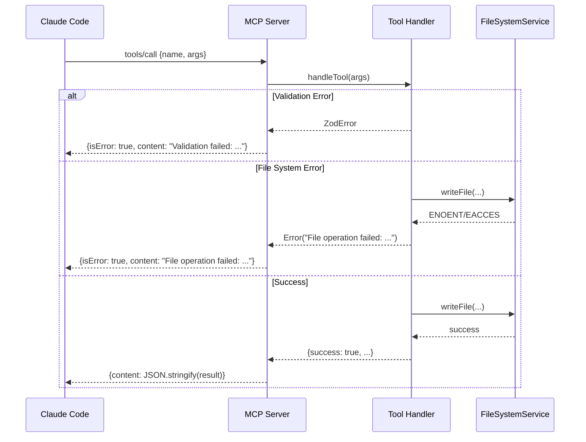

# 17. Error Handling Strategy

## 17.1 Error Flow



## 17.2 Error Response Format

```typescript
// MCP Error Response
interface McpErrorResponse {
  content: [{ type: 'text'; text: string }];
  isError: true;
}

// Error text format
interface ErrorPayload {
  error: string;
  code: string;
  details?: Record<string, unknown>;
}

// Example
{
  isError: true,
  content: [{
    type: 'text',
    text: JSON.stringify({
      error: 'Scenario not found',
      code: 'SCENARIO_NOT_FOUND',
      details: { slug: 'nonexistent-scenario' }
    })
  }]
}
```

## 17.3 MCP Error Handler

```typescript
// packages/mcp-server/src/utils/error-handler.ts
import { ZodError } from 'zod';

export function handleError(error: unknown): { error: string; code: string; details?: unknown } {
  if (error instanceof ZodError) {
    return {
      error: 'Validation failed',
      code: 'VALIDATION_ERROR',
      details: error.flatten(),
    };
  }

  if (error instanceof Error) {
    if (error.message.includes('ENOENT')) {
      return {
        error: 'File or directory not found',
        code: 'NOT_FOUND',
        details: { message: error.message },
      };
    }
    if (error.message.includes('EACCES')) {
      return {
        error: 'Permission denied',
        code: 'PERMISSION_DENIED',
        details: { message: error.message },
      };
    }
    return {
      error: error.message,
      code: 'INTERNAL_ERROR',
    };
  }

  return {
    error: 'Unknown error',
    code: 'UNKNOWN_ERROR',
  };
}
```

## 17.4 Dashboard Error Handling

```typescript
// packages/ux/src/components/common/ErrorBoundary.tsx
import { Component, type ReactNode } from 'react';

interface Props {
  children: ReactNode;
  fallback?: ReactNode;
}

interface State {
  hasError: boolean;
  error: Error | null;
}

export class ErrorBoundary extends Component<Props, State> {
  state: State = { hasError: false, error: null };

  static getDerivedStateFromError(error: Error): State {
    return { hasError: true, error };
  }

  render() {
    if (this.state.hasError) {
      return this.props.fallback || (
        <div className="p-4 bg-red-900/20 text-red-400 rounded">
          <h2 className="font-bold">Something went wrong</h2>
          <p className="text-sm mt-1">{this.state.error?.message}</p>
        </div>
      );
    }

    return this.props.children;
  }
}
```

---
