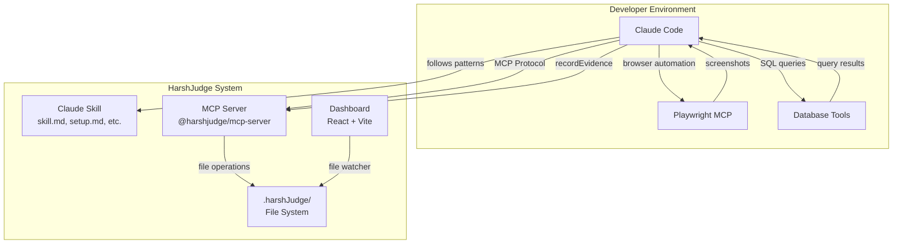

# 2. High Level Architecture

## 2.1 Technical Summary

HarshJudge implements a **local-first, file-system-as-database** architecture with three distinct components communicating through filesystem operations. The MCP server uses the Model Context Protocol (stdio) to receive commands from Claude Code, persisting all data in a `.harshJudge/` directory structure. The React dashboard watches this filesystem for real-time updates. This architecture achieves PRD goals by leveraging Claude's native capabilities for code analysis and test execution while providing organized, reviewable results through deterministic file storage.

## 2.2 Platform and Infrastructure Choice

**Platform:** Local-only (no cloud infrastructure)

**Key Services:**
- Node.js runtime for MCP server
- Vite dev server / static hosting for dashboard
- Filesystem for data storage

**Deployment:** Local installation via npm, no cloud regions required

**Rationale:** HarshJudge is privacy-first and runs entirely on the developer's machine. No external services, no data transmission, no infrastructure costs.

## 2.3 Repository Structure

**Structure:** Monorepo
**Monorepo Tool:** Turborepo
**Package Manager:** pnpm

**Package Organization:**
```
HarshJudge/
├── packages/
│   ├── mcp-server/     # @harshjudge/mcp-server
│   ├── ux/             # @harshjudge/ux (dashboard)
│   └── shared/         # @harshjudge/shared (types)
├── skills/
│   └── harshjudge/     # Claude skill files
└── turbo.json
```

## 2.4 High Level Architecture Diagram



## 2.5 Architectural Patterns

- **File-System-as-Database:** All data persisted as YAML/JSON/Markdown files in `.harshJudge/` - _Rationale:_ Git-friendly, portable, human-readable, no database setup required
- **Skill-Driven Workflow:** Claude Skill provides structured prompts for consistent behavior - _Rationale:_ Ensures deterministic patterns while allowing AI flexibility in execution
- **MCP Data Tunnel:** Lightweight MCP provides only file operations, no business logic - _Rationale:_ Single responsibility, minimal codebase, leverages existing Claude capabilities
- **Read-Only Dashboard:** Dashboard has no write capabilities, purely for visibility - _Rationale:_ All actions via Claude Code reinforces AI-native paradigm
- **Event-Driven Updates:** Dashboard uses file watchers (chokidar) for live updates - _Rationale:_ No polling, immediate feedback, simple implementation

---
