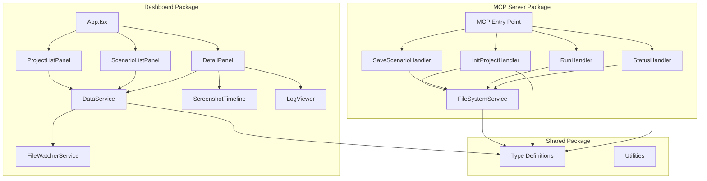

# 6. Components

## 6.1 MCP Server Components

### FileSystemService

**Responsibility:** All file read/write operations for `.harshJudge/` directory

**Key Interfaces:**
- `ensureDir(path: string): Promise<void>`
- `writeYaml(path: string, data: object): Promise<void>`
- `readYaml<T>(path: string): Promise<T>`
- `writeJson(path: string, data: object): Promise<void>`
- `readJson<T>(path: string): Promise<T>`
- `writeFile(path: string, data: Buffer | string): Promise<void>`
- `exists(path: string): Promise<boolean>`
- `listDirs(path: string): Promise<string[]>`

**Dependencies:** Node.js fs/promises, js-yaml

**Technology Stack:** TypeScript, Node.js native fs

---

### InitProjectHandler

**Responsibility:** Handle `initProject` MCP tool calls

**Key Interfaces:**
- `handle(params: InitProjectParams): Promise<InitProjectResult>`

**Dependencies:** FileSystemService

**Technology Stack:** TypeScript, zod validation

---

### SaveScenarioHandler

**Responsibility:** Handle `saveScenario` MCP tool calls

**Key Interfaces:**
- `handle(params: SaveScenarioParams): Promise<SaveScenarioResult>`
- `generateSlug(title: string): string`
- `handleDuplicateSlug(slug: string): string`

**Dependencies:** FileSystemService

**Technology Stack:** TypeScript, zod validation

---

### RunHandler

**Responsibility:** Handle `startRun`, `recordEvidence`, `completeRun` tool calls

**Key Interfaces:**
- `startRun(params: StartRunParams): Promise<StartRunResult>`
- `recordEvidence(params: RecordEvidenceParams): Promise<RecordEvidenceResult>`
- `completeRun(params: CompleteRunParams): Promise<CompleteRunResult>`

**Dependencies:** FileSystemService, nanoid

**Technology Stack:** TypeScript, zod validation, nanoid

---

### StatusHandler

**Responsibility:** Handle `getStatus` MCP tool calls

**Key Interfaces:**
- `handle(params: GetStatusParams): Promise<GetStatusResult>`
- `getProjectStatus(): Promise<ProjectStatus>`
- `getScenarioDetail(slug: string): Promise<ScenarioDetail>`

**Dependencies:** FileSystemService

**Technology Stack:** TypeScript

---

## 6.2 Dashboard Components

### FileWatcherService

**Responsibility:** Watch `.harshJudge/` for changes and emit events

**Key Interfaces:**
- `start(basePath: string): void`
- `stop(): void`
- `onUpdate(callback: () => void): void`

**Dependencies:** chokidar

**Technology Stack:** TypeScript, chokidar

---

### DataService

**Responsibility:** Read and parse `.harshJudge/` data for dashboard

**Key Interfaces:**
- `getProjects(): Promise<ProjectSummary[]>`
- `getScenarios(projectPath: string): Promise<ScenarioSummary[]>`
- `getScenarioDetail(slug: string): Promise<ScenarioDetail>`
- `getRunDetail(runId: string): Promise<RunDetail>`

**Dependencies:** FileWatcherService, js-yaml, marked

**Technology Stack:** TypeScript, React hooks

---

### ProjectListPanel

**Responsibility:** Display list of projects with status indicators

**Key Interfaces:**
- `onSelect(projectPath: string): void`
- Props: `projects: ProjectSummary[]`, `selected: string | null`

**Dependencies:** DataService

**Technology Stack:** React, TailwindCSS

---

### ScenarioListPanel

**Responsibility:** Display scenarios for selected project

**Key Interfaces:**
- `onSelect(slug: string): void`
- Props: `scenarios: ScenarioSummary[]`, `selected: string | null`

**Dependencies:** DataService

**Technology Stack:** React, TailwindCSS

---

### DetailPanel

**Responsibility:** Display scenario details, run history, and run viewer

**Key Interfaces:**
- Props: `scenario: ScenarioDetail | null`, `selectedRun: string | null`

**Dependencies:** DataService, ScreenshotTimeline, LogViewer

**Technology Stack:** React, TailwindCSS, marked

---

### ScreenshotTimeline

**Responsibility:** Step-by-step timeline view of run screenshots

**Key Interfaces:**
- `onStepSelect(step: number): void`
- Props: `evidence: Evidence[]`, `currentStep: number`

**Dependencies:** None

**Technology Stack:** React, TailwindCSS

---

### LogViewer

**Responsibility:** Display captured logs for failed runs

**Key Interfaces:**
- Props: `logs: Evidence[]`, `activeTab: string`

**Dependencies:** None

**Technology Stack:** React, TailwindCSS

---

## 6.3 Component Diagram

---
