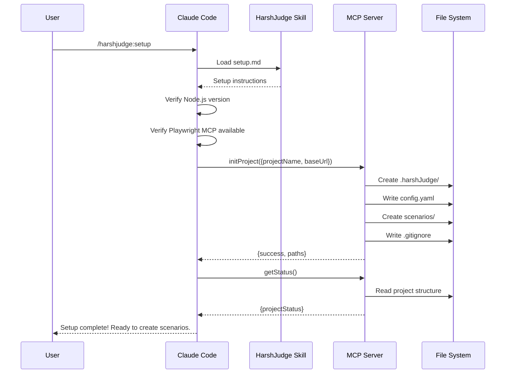
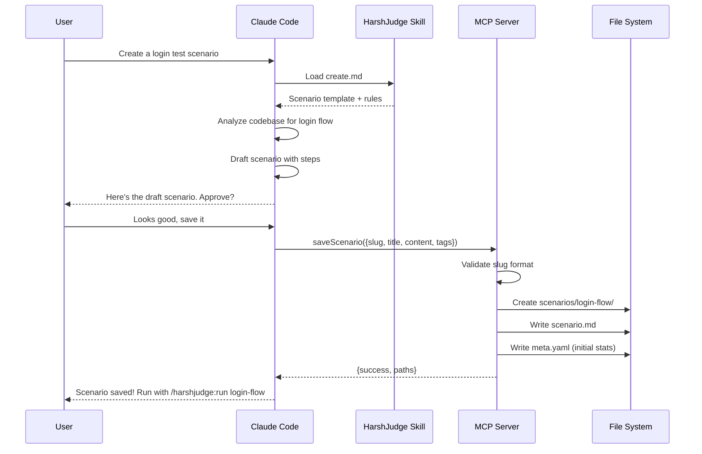
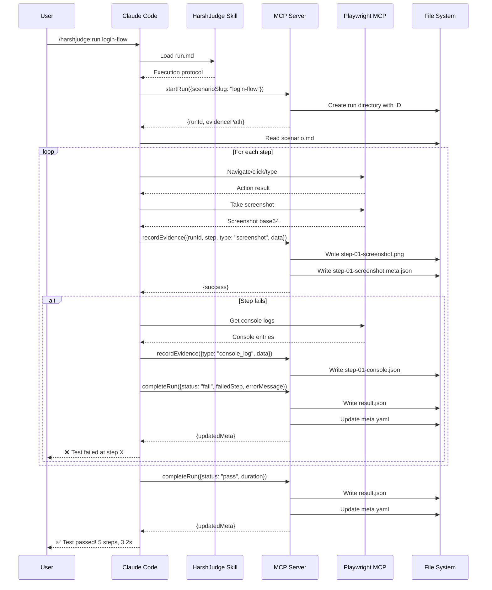
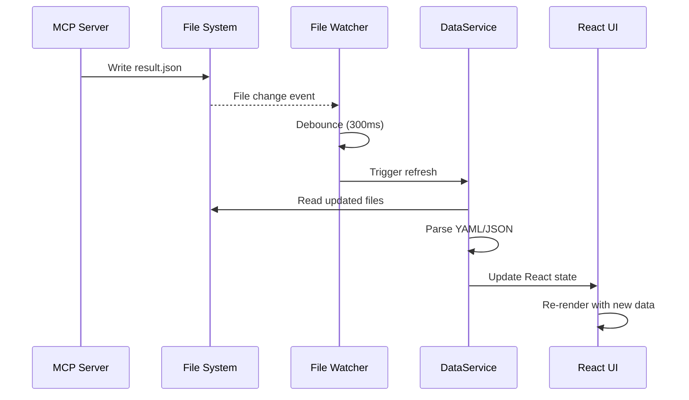

# 7. Core Workflows

## 7.1 Project Initialization Workflow

```mermaid
sequenceDiagram
    participant User
    participant Claude as Claude Code
    participant Skill as HarshJudge Skill
    participant MCP as MCP Server
    participant FS as File System

    User->>Claude: /harshjudge:setup
    Claude->>Skill: Load setup.md
    Skill-->>Claude: Setup instructions

    Claude->>Claude: Verify Node.js version
    Claude->>Claude: Verify Playwright MCP available

    Claude->>MCP: initProject({projectName, baseUrl})
    MCP->>FS: Create .harshJudge/
    MCP->>FS: Write config.yaml
    MCP->>FS: Create scenarios/
    MCP->>FS: Write .gitignore
    MCP-->>Claude: {success, paths}

    Claude->>MCP: getStatus()
    MCP->>FS: Read project structure
    MCP-->>Claude: {projectStatus}

    Claude-->>User: Setup complete! Ready to create scenarios.
```

## 7.2 Scenario Creation Workflow

```mermaid
sequenceDiagram
    participant User
    participant Claude as Claude Code
    participant Skill as HarshJudge Skill
    participant MCP as MCP Server
    participant FS as File System

    User->>Claude: Create a login test scenario
    Claude->>Skill: Load create.md
    Skill-->>Claude: Scenario template + rules

    Claude->>Claude: Analyze codebase for login flow
    Claude->>Claude: Draft scenario with steps

    Claude-->>User: Here's the draft scenario. Approve?
    User->>Claude: Looks good, save it

    Claude->>MCP: saveScenario({slug, title, content, tags})
    MCP->>MCP: Validate slug format
    MCP->>FS: Create scenarios/login-flow/
    MCP->>FS: Write scenario.md
    MCP->>FS: Write meta.yaml (initial stats)
    MCP-->>Claude: {success, paths}

    Claude-->>User: Scenario saved! Run with /harshjudge:run login-flow
```

## 7.3 Test Execution Workflow

```mermaid
sequenceDiagram
    participant User
    participant Claude as Claude Code
    participant Skill as HarshJudge Skill
    participant MCP as MCP Server
    participant PW as Playwright MCP
    participant FS as File System

    User->>Claude: /harshjudge:run login-flow
    Claude->>Skill: Load run.md
    Skill-->>Claude: Execution protocol

    Claude->>MCP: startRun({scenarioSlug: "login-flow"})
    MCP->>FS: Create run directory with ID
    MCP-->>Claude: {runId, evidencePath}

    Claude->>FS: Read scenario.md

    loop For each step
        Claude->>PW: Navigate/click/type
        PW-->>Claude: Action result

        Claude->>PW: Take screenshot
        PW-->>Claude: Screenshot base64

        Claude->>MCP: recordEvidence({runId, step, type: "screenshot", data})
        MCP->>FS: Write step-01-screenshot.png
        MCP->>FS: Write step-01-screenshot.meta.json
        MCP-->>Claude: {success}

        alt Step fails
            Claude->>PW: Get console logs
            PW-->>Claude: Console entries

            Claude->>MCP: recordEvidence({type: "console_log", data})
            MCP->>FS: Write step-01-console.json

            Claude->>MCP: completeRun({status: "fail", failedStep, errorMessage})
            MCP->>FS: Write result.json
            MCP->>FS: Update meta.yaml
            MCP-->>Claude: {updatedMeta}

            Claude-->>User: ❌ Test failed at step X
        end
    end

    Claude->>MCP: completeRun({status: "pass", duration})
    MCP->>FS: Write result.json
    MCP->>FS: Update meta.yaml
    MCP-->>Claude: {updatedMeta}

    Claude-->>User: ✅ Test passed! 5 steps, 3.2s
```

## 7.4 Dashboard Update Workflow

```mermaid
sequenceDiagram
    participant MCP as MCP Server
    participant FS as File System
    participant Watcher as File Watcher
    participant Data as DataService
    participant UI as React UI

    MCP->>FS: Write result.json
    FS-->>Watcher: File change event

    Watcher->>Watcher: Debounce (300ms)
    Watcher->>Data: Trigger refresh

    Data->>FS: Read updated files
    Data->>Data: Parse YAML/JSON
    Data->>UI: Update React state

    UI->>UI: Re-render with new data
```

---
